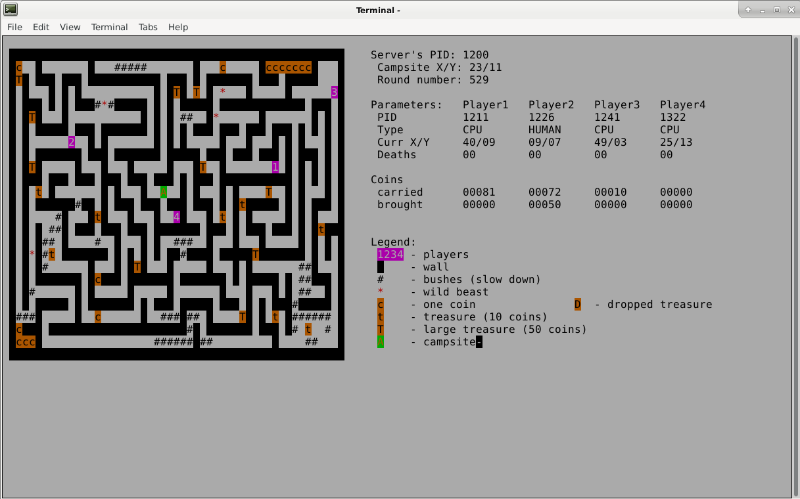
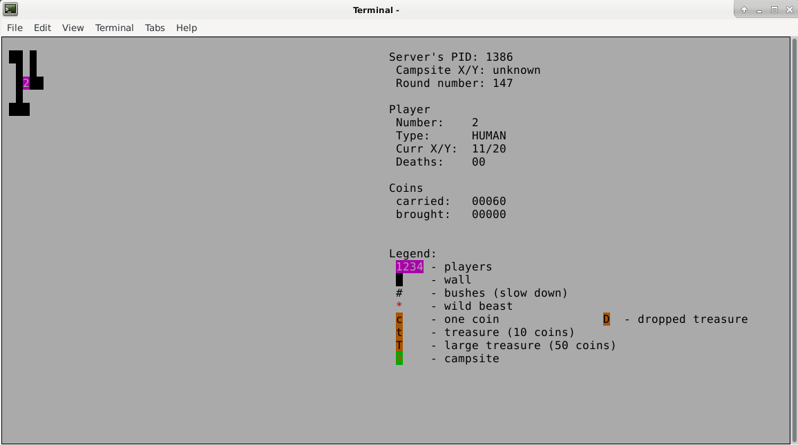
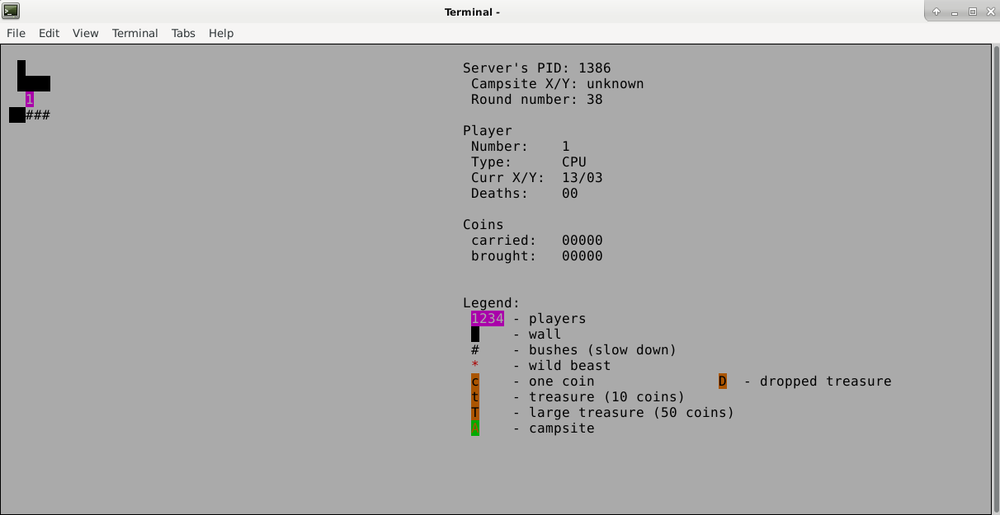

# Gra-labirynt
Gra labirynt, napisana w języku C. Umożliwia ona dołączenie do serwera oraz równoległe granie czterem niezależnym graczom.

Celem gry jest zbieranie pojawiajacych się skarbów na mapie oraz zanoszenie ich do swoich obozowisk gdzie zostają one zapisane. Podczas zbierania skarbów, gracze muszą uważać na bestie poruszajace się po mapie oraz aby nie zderzyć się z innymi graczami. Gracz może zginąć poprzez zderzenie się bestią lub też z innym gracze. Po śmierci zostaje on przeniesiony do swojego punktu startowego oraz traci wszystkie punkty które nie zdążył zanieść do swojego obozowiska. W miejscu jego śmieci pozostaje utracony łup, może on zostać podniesionym przez dowolnego gracza. Na mapie znajdują się również przeszkody w postaci krzaków, przejście przez nie zajmuje dwie tury gracza podczas których próbuje przez nie przejsć.

Dostepne typy graczy:
* gracz-człowiek
* gracz-bot

Widok serwera:

Widok gracza:

Widok bota:

